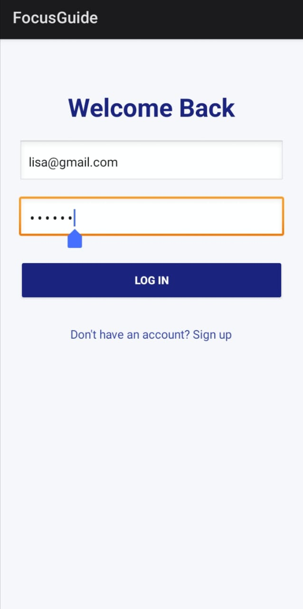
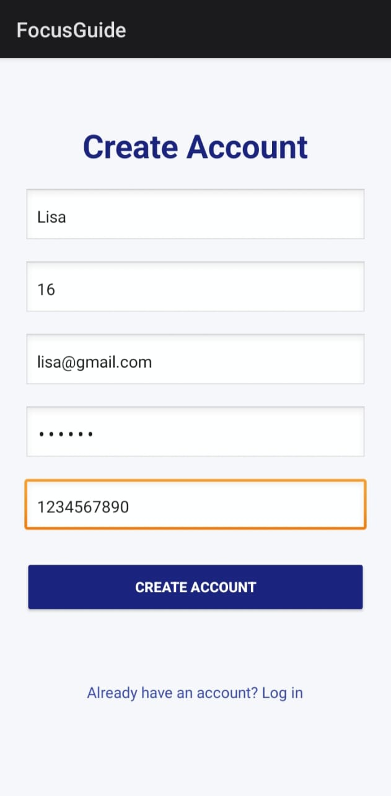
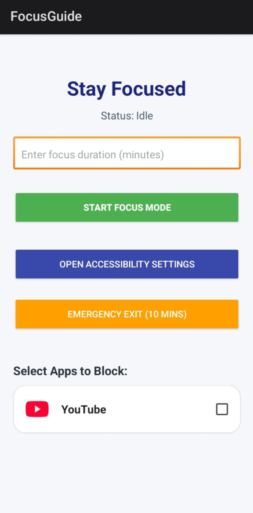
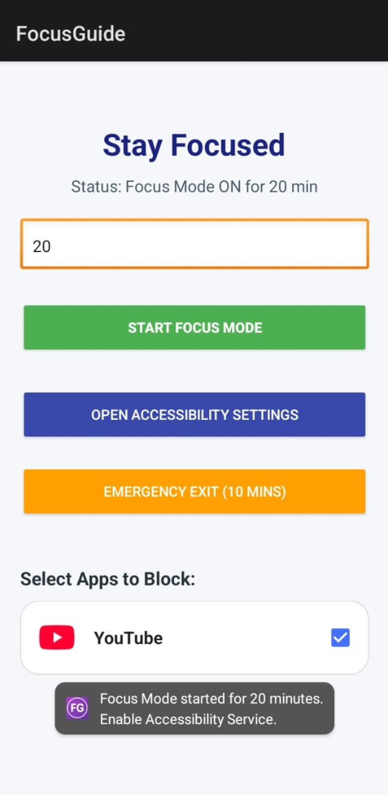
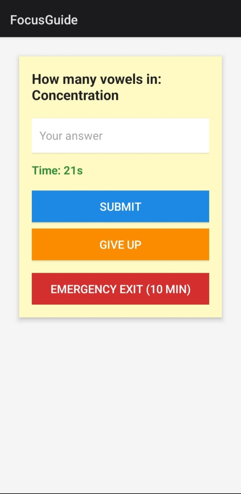

# FocusGuide-app
FocusGuide is a productivity app that blocks selected apps for a user-defined time. Users can unlock blocked apps by completing a challenge, earning 5 minutes of access each time. It also includes a 10-minute emergency exit (once every 24 hours) and can notify a parent/guardian if the user is a minor.

## Features
- App blocking
- Challenge-based unlocking
- 5-minute temporary access
- Emergency Exit for 10 minutes
- Parent notification for minors

## Tech Stack
- Android SDK
- Java
- XML
- SharedPreferences

## 📸 Screenshots

### Login Screen

### Sign Up Screen

### Home Screen

### Focus Mode

### Challenge Screen

### Parent Alert

## 🚀 Future Enhancements

- Multiple challenge types
- Weekly focus statistics
- Focus streak tracking
- Dark mode
- Cloud backup
- Custom challenge creation

## 👩‍💻 Developer

**Sonali M**

GitHub: https://github.com/sonalimcodes  
  
  
